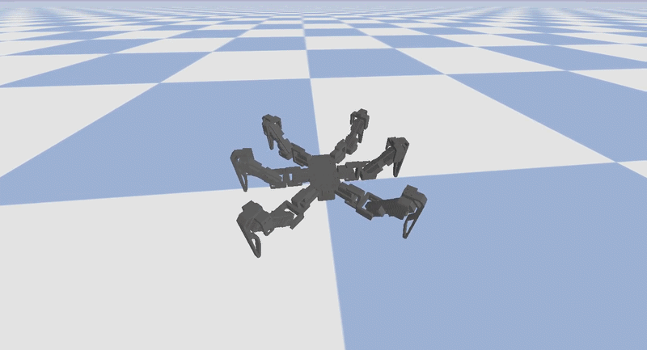

# Hexapod Simulation

This repository includes the code to simulate the Hexapod. 
It includes code to visualize and interact with the robot in Viser and code to simulate it in a PyBullet environment. 

<table>
  <tr>
    <td></td>
    <td></td>
  </tr>
  <tr>
    <td></td>
    <td></td>
  </tr>
</table>

For a complete overview of the project, refer to the [main Hexapod repository](https://github.com/ggldnl/Hexapod).

## 🛠️ Setup

Before you start, ensure `mamba` is properly installed on the machine you are using for the simulation.

1. Clone the repository:

   ```bash
    git clone --recursive https://github.com/ggldnl/Hexapod-Simulation.git
    ```
   
   The [Hexapod-Controller](https://github.com/ggldnl/Hexapod-Controller.git) and [Hexapod-Hardware]((https://github.com/ggldnl/Hexapod-Hardware.git)) repositories are configured as submodules and are automatically downloaded. If for some reason you need to update the submodules in the future:

    ```bash
    # Update the submodules if something changes in the future
    git submodule update --recursive --remote
    ```
   
    I chose to use Hexapod-Controller as a submodule so that I could modify the code and immediately test the results in simulation.

2. Create a mamba environment:

    ```bash
    cd Hexapod-Simulation
    mamba env create -f environment.yml
    mamba activate hexapod-sim
    ```
   
   The Hexapod-Controller code will be automatically installed as a package. After this, from within the `hexapod-sim` mamba environment, you will be able to do something like this:

   ```python
   from controller import HexapodController
   ```
   
## 🚀 Delpoy

- `viser/main.py` will open a Viser-based Hexapod demo, showing the Hexapod moving forward and performing some adjustments along the way (body height, yaw, speed, ...).  

   ```bash
   python simulation/viser/main.py
   ```

- `bullet/main.py` will open a PyBullet Hexapod simulation, showing how the robot behaves when physics is involved. 
I used the actual stall torque the servos are rated for to simulate the motors.

   ```bash
   python simulation/bullet/main.py
   ```

- `bullet/teleop.py` lets you drive the robot live in PyBullet with a game controller (PS3/Xbox-style) or the keyboard. It runs the exact same controller, kinematics and gait code as the real robot, but without the UART link — so there are no serial round-trips or servo lag.

   ```bash
   python simulation/bullet/teleop.py            # joystick if present, else keyboard
   python simulation/bullet/teleop.py --calibrate # print live axis/button indices for your pad
   ```

   Left stick translates, right stick turns (and tilts the body); hold R1 as a deadman. Keyboard fallback: `WASD` to move, `Q`/`E` to turn, `R`/`F` for height, `1`/`2`/`3` to switch gait. See the module docstring for the full mapping.

## 🤝 Contribution

Feel free to contribute by opening issues or submitting pull requests. For further information, check out the [main Hexapod repository](https://github.com/ggldnl/Hexapod). Give a ⭐️ to this project if you liked the content.
