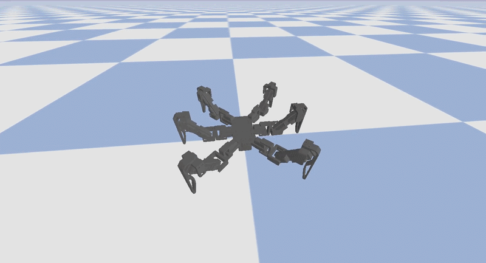

# Hexapod Simulation

This repository includes the code to simulate the Hexapod.
It includes code to visualize and interact with the robot in Viser and code to simulate it in a PyBullet environment.

<table>
  <tr>
    <td></td>
    <td></td>
  </tr>
  <tr>
    <td></td>
    <td></td>
  </tr>
</table>

For a complete overview of the project, refer to the [main Hexapod repository](https://github.com/ggldnl/Hexapod).

## 🧠 How it works

The simulation runs the real firmware core in-process. The [Hexapod-Firmware](https://github.com/ggldnl/Hexapod-Firmware.git) C++ code is compiled into a shared library, and a small ctypes bridge lets Python call it. The same Pi-side [Hexapod-Controller](https://github.com/ggldnl/Hexapod-Controller.git) that talks to the real board drives this library instead of a serial port, and the [Hexapod-Hardware](https://github.com/ggldnl/Hexapod-Hardware.git) URDF and meshes are rendered on top.

The three repositories are pulled in as submodules at the repo root:

```
Hexapod-Controller   # Pi-side hexapod client package, installed editable
Hexapod-Firmware     # C++ core, compiled into bridge/libhexapod_fw.so
Hexapod-Hardware     # URDF + STL meshes the renderers use
bridge/              # sim_bridge.cpp + build.sh, the ctypes glue
simulation/          # the sim package, with the viser and bullet front-ends
```

## 🌿 Branches

Two versions of the robot currently exist. Each branch pins its own commits of the submodules.

| Branch      | What differs                                                                                                                                                                                                       |
|-------------|--------------------------------------------------------------------------------------------------------------------------------------------------------------------------------------------------------------------|
| `main`      | Original version                                                                                                                                                                                                   |
| `new-tibia` | Tibia redesigned, bigger range of motion. The attachment point is unchanged, so the URDF's joints are identical between the two. What differs is the mesh and the config that describes it to the kinematic model. |

> ⚠️ ️A submodule is pinned by **commit**, not by branch, so checking out a branch here does *not* move the submodules with it. Always follow the checkout with an update, or you get one version's meshes driven by the other version's config:

```bash
git checkout new-tibia && git submodule update --init --recursive
```

```bash
git checkout main && git submodule update --init --recursive
```

That leaves each submodule on a detached HEAD at the pinned commit, which is normal here — attach to a branch only when you intend to commit something.

Rerun `./bridge/build.sh` whenever the Hexapod-Firmware pointer moves. A `libhexapod_fw.so` older than the firmware's protocol rejects provisioning (mismatch in args size), and the core falls back to its baked-in defaults: the robot then ignores `config.yml` entirely, which looks like a kinematics bug but is a stale build. The warning is printed at startup.

## 🛠️ Setup

You need a C++ compiler (g++) to build the firmware core and `mamba` (or `conda`) for the Python environment.

1. Clone the repository with its submodules:

   ```bash
   git clone --recursive https://github.com/ggldnl/Hexapod-Simulation.git
   cd Hexapod-Simulation
   ```

   If you already cloned without `--recursive`, pull the submodules in:

   ```bash
   git submodule update --init --recursive
   ```

   To bump the submodules to their latest upstream commit later:

   ```bash
   git submodule update --recursive --remote
   ```

   Hexapod-Firmware and Hexapod-Controller being submodules means we can edit them locally, recompile and immediately test the change in simulation.

2. Build the firmware core into a shared library:

   ```bash
   ./bridge/build.sh
   ```

   This compiles the Hexapod-Firmware C++ core into `bridge/libhexapod_fw.so`. Rerun it whenever the firmware submodule changes.

3. Create the environment:

   ```bash
   mamba env create -f environment.yml
   mamba activate hexapod-sim
   ```

   This installs the dependencies and the Hexapod-Controller submodule in editable mode, so `import hexapod` works inside the environment.

## 🚀 Run

The front-ends run as modules from the repository root, with the `hexapod-sim` environment active.

- Viser browser demo, showing the Hexapod moving forward and adjusting body height, yaw and speed along the way:

  ```bash
  python -m simulation.viser.main
  ```

  Open the printed URL (default http://localhost:8080). Viser has no physics, so the body stays put and the legs cycle in place while you drive the gait from the control panel.

  The *Kinematic model* panel draws the model from `config.yml` over the mesh: the leg chains, the ground plane the firmware thinks it is standing on, the foot contacts and their support polygon, and the stance the config asks for. Turn the meshes off to read the skeleton on its own. The *Stance* readout gives the same thing as numbers (body height, per-leg stance radius and ground clearance), and *config.yml vs URDF* compares the hand-written link lengths and mounts against the CAD they are meant to describe. The board is provisioned from that same `config.yml` at startup (`--config PATH`, or `--no-provision` to keep the firmware's baked defaults).

- PyBullet physics demo, showing how the robot behaves once physics is involved. It uses the stall torque the servos are rated for to model the motors:

  ```bash
  python -m simulation.bullet.main
  ```

- PyBullet teleop, driving the robot live with a game controller (PS3/Xbox-style) or the keyboard:

  ```bash
  python -m simulation.bullet.teleop             # joystick if present, else keyboard
  python -m simulation.bullet.teleop --calibrate # print live axis/button indices for your pad
  ```

  Left stick translates, right stick turns and tilts the body, hold R1 as a deadman. Keyboard fallback: `WASD` to move, `Q`/`E` to turn, `R`/`F` for height, `1`/`2`/`3` to switch gait. See the module docstring for the full mapping.

## 🤝 Contribution

Feel free to contribute by opening issues or submitting pull requests. For further information, check out the [main Hexapod repository](https://github.com/ggldnl/Hexapod). Give a ⭐️ to this project if you liked the content.
